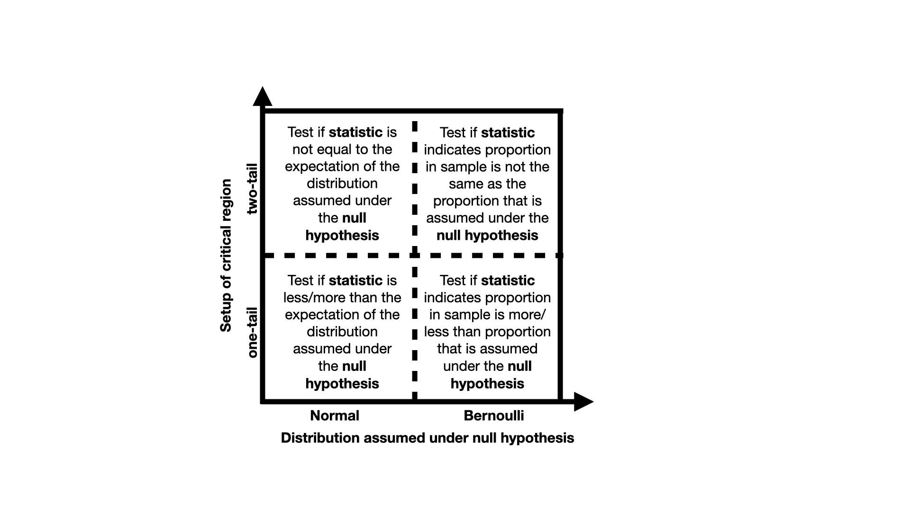

# Summary

Congratulations on completing all the tasks.  By completing those tasks you have demonstrated that you understand how the workflow that is illustrated in this flow chart below is used to perform simple hypotheses tests. 

Thus far we have performed the four types of hypothesis tests that are illustrated in the figure below:

To complete this exercise demonstrate that you understand the distinctions above by replacing the ??s in the four sentences that are printed by the code on the left.  Each ?? needs to be replaced with either one, two, Normal or Bernoulli. 

PROBLEMS

# Problem 1
print("To test if more men get sick with flu than women you would use a")
print("??-tail test.  A ?? distribution would be assumed under the null hypothesis")

# Problem 2
print("To test if the machine that puts the tea leaves in the bags is broken and")
print("that it is putting the wrong mass of tea into each bag you use a ??-tail")
print("test.  A ?? distribution would be assumed under the null hypothesis")

# Problem 3
print("To test if women are under represented in the professoriat of a university")
print("you would use a ??-tail test.  A ?? distribution would be assumed under the")
print("null hypothesis")

# Problem 4
print("To test if women are paid less than men you would use a ??-tail test")
print("A ?? distribution would be assumed under the null hypothesis")
